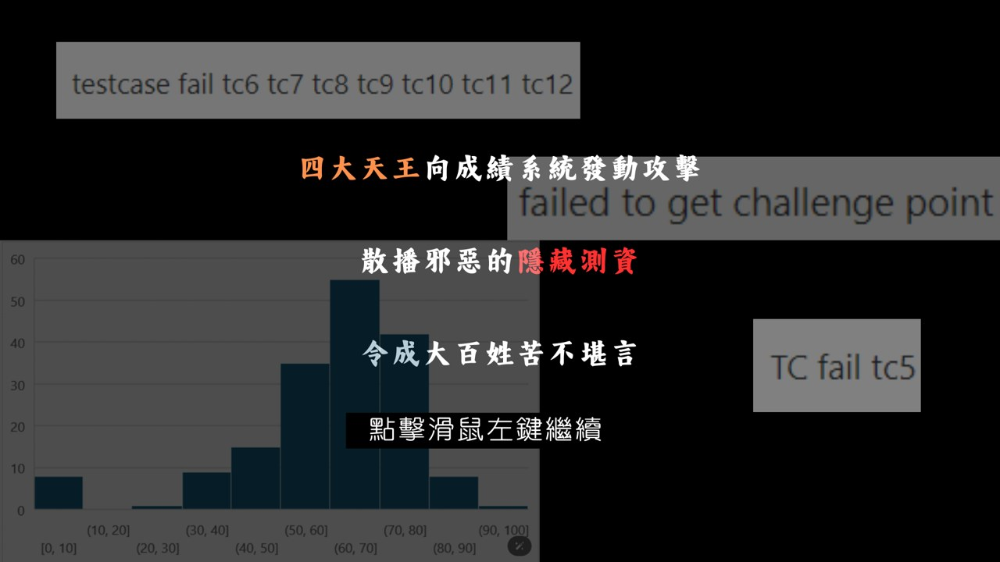
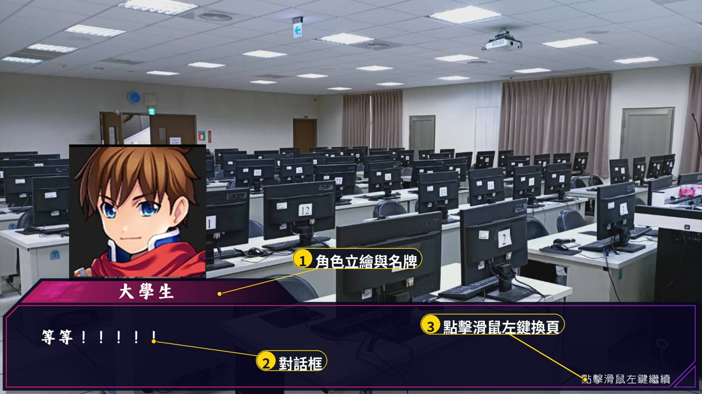
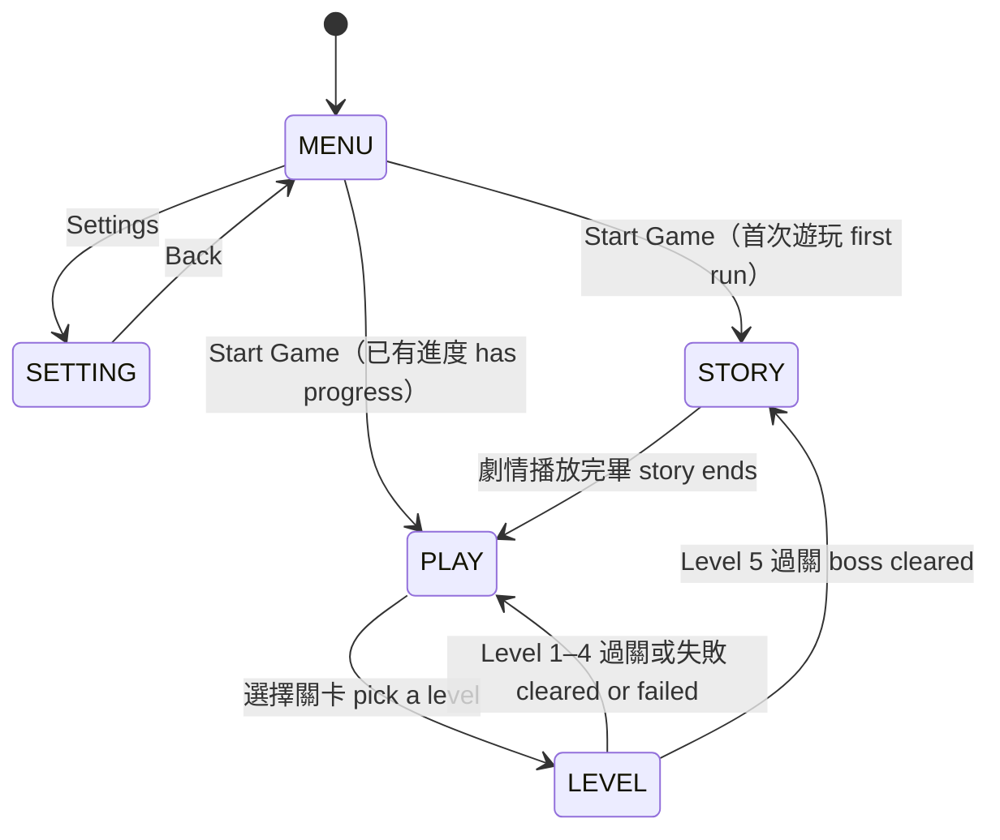
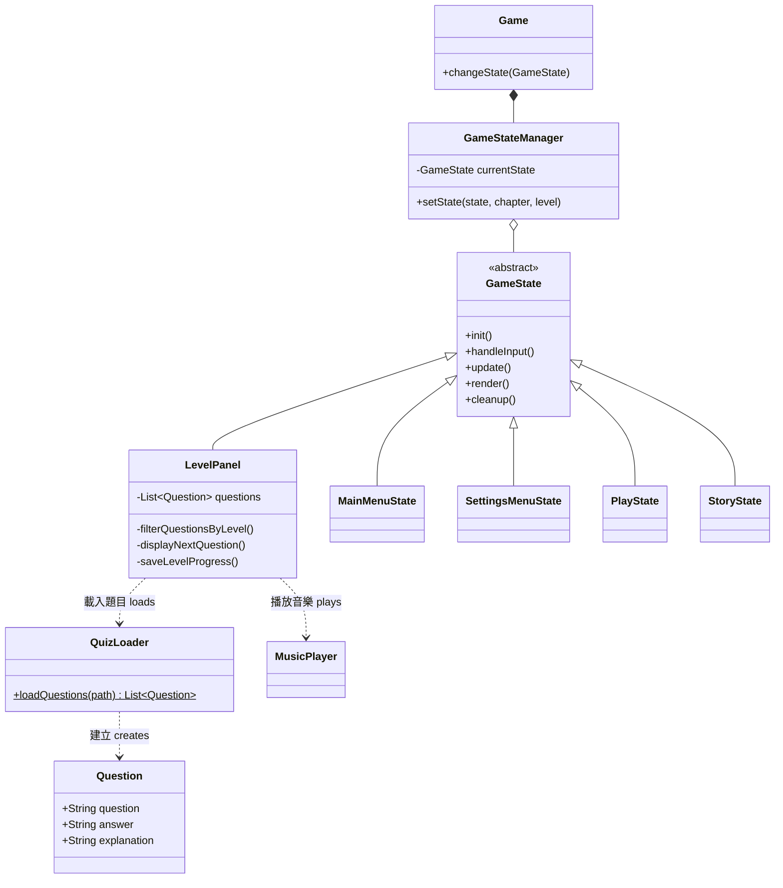

<p align="center">
  
</p>

# Program Design II 問答式戰鬥 RPG：以狀態模式實作的 Java 桌面遊戲

**Program Design II — A Quiz-Battle RPG Built on the State Pattern**

> 國立成功大學資訊工程學系「程式設計（二）」期末專案（2024）
>
> Final project for *Program Design (II)*, Department of Computer Science and Information Engineering, National Cheng Kung University (2024)

PROGRAM DESIGN II 是一款操作極簡的 **問答式戰鬥 RPG**。

故事發生在一個被稱作「**國立成功大學**」的幻想世界。在這裡，被選中的人將被授予「**Java 大法**」，獲得物件導向之力。你將扮演一位名為「**大學生**」的神秘角色，在旅途中邂逅性格各異、能力獨特的同伴，和他們一起擊敗強敵、找回失散的學分，並逐步揭開「程式設計二」的真相。

你唯一的武器，是腦中的 Java 觀念。五個章節、二十五道關卡、一百道題目，每一章的盡頭都有魔王等著你。不論答對或答錯，每一題都附上詳解，所以打完這場仗，期末考也順便複習完了。

*準備好了嗎？點擊滑鼠左鍵，開始你的旅程。*

PROGRAM DESIGN II is a **quiz-battle RPG** you play with nothing but a mouse.

The story takes place in a fantasy world known as "**National Cheng Kung University**". Here, the chosen ones are granted "**the Art of Java**" and with it the power of object orientation. You play a mysterious figure called "**the Undergraduate**". Along the way you meet companions of every temperament and talent, defeat powerful enemies together, recover your lost credits, and gradually uncover the truth behind "Program Design II".

Your only weapon is the Java you carry in your head. Five chapters, twenty-five levels and one hundred questions lie ahead, with a boss waiting at the end of every chapter. Right or wrong, every question comes with an explanation, so by the time the battle is over you have also reviewed for the final exam.

*Ready? Click the left mouse button to begin your journey.*

---

## 目錄 Contents

- [遊戲畫面 Screenshots](#遊戲畫面-screenshots)
- [系統設計 System Design](#系統設計-system-design)
- [題庫系統 Question Bank](#題庫系統-question-bank)
- [劇情系統 Story System](#劇情系統-story-system)
- [分工 Contributions](#分工-contributions)
- [建置與執行 Build and Run](#建置與執行-build-and-run)
- [專案結構 Project Structure](#專案結構-project-structure)
- [已知限制 Known Limitations](#已知限制-known-limitations)

---

## 遊戲畫面 Screenshots

以下各圖的編號標註說明該畫面的功能，圖下文字補充對應的規則。

The numbered callouts on each screenshot mark what each part of the screen does; the note below each one adds the rules that apply.

### 1. 主選單 Main Menu

<p align="center"></p>

> **說明**　程式啟動後進入主選單。按下 **Start Game** 時，系統會檢查關卡進度檔：若尚無任何紀錄，視為首次遊玩，先播放前情提要再進入關卡選擇；否則直接進入關卡選擇。
>
> **Note**　The game opens on the main menu. When **Start Game** is pressed, the progress file is checked: if it holds no record, this is treated as a first run and the prologue plays before level selection; otherwise the game goes straight to level selection.

### 2. 關卡選擇 Level Selection

<p align="center"></p>

> **說明**　全遊戲共 5 個 Chapter，每個 Chapter 有 5 個 Level。Level 5 為該章的魔王關，按鈕預設為灰色，須通過同章的 Level 1–4 才能進入。
>
> **Note**　The game has 5 chapters of 5 levels each. Level 5 is the chapter's boss level; its button is greyed out until Levels 1–4 of the same chapter have been cleared.

### 3. 戰鬥 Battle

<p align="center"></p>

> **說明**　畫面上方為雙方生命值，中央為題目，下方為 A–D 四個選項。題目由該章的題庫載入後隨機排序。
>
> **Note**　Both sides' hearts are shown at the top, the question in the middle, and the four options A–D at the bottom. Questions are loaded from the chapter's question bank and shuffled.
>
> | 關卡 Level | 題目來源 Questions | 過關條件 Win | 失敗條件 Lose |
> | --- | --- | --- | --- |
> | Level 1–4 | 該章題庫各取 5 題<br>5 questions each from the chapter's bank | 答對 5 題<br>5 correct | 答錯 3 題<br>3 wrong |
> | Level 5（魔王關 Boss） | 該章全部 20 題<br>All 20 questions of the chapter | 答對 15 題<br>15 correct | 答錯 5 題<br>5 wrong |

### 4. 作答回饋 Answer Feedback

<table>
<tr>
<td width="50%"></td>
<td width="50%"></td>
</tr>
<tr>
<td align="center"><b>答對</b>：敵方扣一顆心<br><b>Correct</b>: the enemy loses a heart</td>
<td align="center"><b>答錯</b>：我方扣一顆心<br><b>Incorrect</b>: the player loses a heart</td>
</tr>
</table>

> **說明**　不論答對或答錯，系統都會彈出詳解視窗，說明正確答案與各選項錯誤的原因。這是本遊戲「邊玩邊複習」的核心設計。
>
> **Note**　Whether the answer is right or wrong, a dialog explains the correct answer and why the other options fail. This is the core of the game's "review while you play" design.

### 5. 過關與失敗 Victory and Defeat

<table>
<tr>
<td width="50%"></td>
<td width="50%"></td>
</tr>
<tr>
<td align="center"><b>過關</b>：寫入關卡進度<br><b>Victory</b>: progress is saved</td>
<td align="center"><b>失敗</b>：返回關卡選擇<br><b>Defeat</b>: back to level selection</td>
</tr>
</table>

> **說明**　過關後進度會寫入 `level_progress.json`。通過魔王關（Level 5）後，系統會播放該章的劇情，再回到關卡選擇。
>
> **Note**　On victory, progress is written to `level_progress.json`. After the boss level (Level 5) is cleared, the chapter's story plays before the game returns to level selection.

### 6. 劇情 Story

<table>
<tr>
<td width="50%"></td>
<td width="50%"></td>
</tr>
<tr>
<td align="center"><b>旁白頁</b>：前情提要的開場<br><b>Narration</b>: opening of the prologue</td>
<td align="center"><b>前情提要</b>：四大天王登場<br><b>Prologue</b>: the Four Heavenly Kings appear</td>
</tr>
<tr>
<td width="50%"></td>
<td width="50%"></td>
</tr>
<tr>
<td align="center"><b>對話頁</b>：角色立繪、名牌與對話框<br><b>Dialogue</b>: character portrait, name plate and text box</td>
<td align="center"><b>章節劇情</b>：通過魔王關後播放<br><b>Chapter story</b>: plays after the boss level</td>
</tr>
</table>

> **說明**　劇情分為前情提要與五個章節，共 942 頁，以校園實景為背景，分為旁白頁與對話頁兩種版面。首次遊玩時播放前情提要，之後每通過一章的魔王關，就播放該章劇情。玩家點擊滑鼠左鍵換頁。
>
> **Note**　The story consists of a prologue and five chapters, 942 pages in all, set against photographs of the campus and laid out as either narration pages or dialogue pages. The prologue plays on the first run, and each chapter's story plays once its boss level is cleared. A left click advances the page.

---

## 系統設計 System Design

### 狀態模式 State Pattern

遊戲的每個畫面是一個「狀態」。所有狀態繼承抽象類別 `GameState`，實作相同的五個方法；`GameStateManager` 持有目前的狀態，並負責切換。切換時先呼叫舊狀態的 `cleanup()` 釋放資源，再建立新狀態並呼叫 `init()`，最後由 `Game`（`JFrame`）換上新狀態的面板。

Every screen in the game is a "state". All states extend the abstract class `GameState` and implement the same five methods; `GameStateManager` holds the current state and handles transitions. On a transition it calls `cleanup()` on the old state to release resources, creates the new state and calls its `init()`, and `Game` (a `JFrame`) then swaps in the new state's panel.

```java
public abstract class GameState {
    public abstract void init();
    public abstract void handleInput();
    public abstract void update();
    public abstract void render();
    public abstract void cleanup();
}
```

這樣的設計使各畫面的邏輯彼此獨立：新增一個畫面只需新增一個 `GameState` 子類別，並在 `GameStateManager` 登記，不必更動其他畫面。

This keeps each screen's logic independent: adding a screen means adding one `GameState` subclass and registering it in `GameStateManager`, without touching the others.

### 狀態轉移 State Transitions



| 狀態常數<br>Constant | 類別<br>Class | 職責<br>Responsibility |
| --- | --- | --- |
| `MENU` | `MainMenuState` | 主選單；判斷是否為首次遊玩<br>Main menu; detects a first run |
| `SETTING` | `SettingsMenuState` | 設定選單<br>Settings menu |
| `PLAY` | `PlayState` | 關卡選擇；讀取進度並控制魔王關的解鎖<br>Level selection; reads progress and gates the boss level |
| `LEVEL` | `LevelPanel` | 戰鬥；出題、判定對錯、計算生命值、儲存進度<br>Battle; asks questions, checks answers, tracks hearts, saves progress |
| `STORY` | `StoryState` | 劇情播放<br>Story playback |

### 類別關係 Class Relationships

下圖僅列出核心類別。完整的類別圖見 [`doc/ClassDiagram.png`](doc/ClassDiagram.png)。

The diagram below shows the core classes only. The full class diagram is in [`doc/ClassDiagram.png`](doc/ClassDiagram.png).



---

## 題庫系統 Question Bank

題庫與程式分離，每個章節對應一個 JSON 檔（`assets/question/question_1.json` 至 `question_5.json`），各 20 題，共 100 題。每一題包含題目、正確答案與詳解三個欄位：

The question bank is kept apart from the code. Each chapter has one JSON file (`assets/question/question_1.json` to `question_5.json`) of 20 questions, 100 in total. Each entry has three fields: the question, the correct answer and an explanation.

```json
{
  "question": "Q: 若一個 Java 類別使用一個介面(Interface)，它必須使用以下那一個關鍵字？\nA extends\nB inherits\nC super\nD implements",
  "answer": "D",
  "explanation": "在 Java 中，當一個類別要使用一個介面時，必須使用關鍵字 implements……"
}
```

載入流程如下：

1. `QuizLoader.loadQuestions()` 以 Jackson 的 `ObjectMapper` 將 JSON 反序列化為 `List<Question>`；
2. `LevelPanel` 依關卡編號取出對應區段：Level 1–4 各取 5 題，Level 5 取該章全部 20 題；
3. 以 `Collections.shuffle()` 隨機排序後依序出題。

由於題目資料與程式邏輯分離，擴充題庫只需編輯 JSON 檔，不需重新編譯。

Loading works as follows:

1. `QuizLoader.loadQuestions()` uses Jackson's `ObjectMapper` to deserialize the JSON into a `List<Question>`;
2. `LevelPanel` takes the slice for the level: 5 questions each for Levels 1–4, and all 20 of the chapter for Level 5;
3. the slice is shuffled with `Collections.shuffle()` and asked in that order.

Because question data is separate from program logic, extending the bank only requires editing the JSON files; nothing has to be recompiled.

---

## 劇情系統 Story System

劇情以逐頁圖片呈現，玩家點擊滑鼠左鍵換頁。各章的圖片資料夾、頁數與副檔名記錄在 `assets/chapter/chapters.json`：

The story is shown as a sequence of full-screen images that advance on a left click. Each chapter's image folder, page count and file extension are recorded in `assets/chapter/chapters.json`:

```json
[
  { "path": "assets/chapter/PD2-previou", "count": 24,  "type": "png" },
  { "path": "assets/chapter/PD2-s1",      "count": 197, "type": "png" }
]
```

`StoryState` 讀取這份設定後，依序載入 `path/1.type`、`path/2.type`……直到最後一頁，再通知 `GameStateManager` 切回關卡選擇。前情提要加上五個章節，共 942 頁劇情畫面。

`StoryState` reads this file and loads `path/1.type`, `path/2.type` and so on up to the last page, then tells `GameStateManager` to return to level selection. The prologue and five chapters come to 942 story pages in total.

---

## 分工 Contributions

| 成員 Member | 負責項目 Responsibilities |
| --- | --- |
| **部政佑** [@pukyle](https://github.com/pukyle) | 劇情系統與各章劇情畫面製作、整體 UI 設計、題庫系統<br>Story system and story pages for every chapter, overall UI design, question bank |
| 江婕瀅 [@Jesse-Jumbo](https://github.com/Jesse-Jumbo/) | <!-- TODO：請確認 --> 遊戲狀態架構整合、Gradle 建置、音樂播放<br>Game-state architecture and integration, Gradle build, music playback |
| 黃若慈 [@huang-rose](https://github.com/huang-rose) | <!-- TODO：請確認 --> 劇情內容編修、錯誤修正<br>Story editing, bug fixes |

---

## 建置與執行 Build and Run

**環境需求**：JDK 17 以上。專案內含 Gradle Wrapper，不需另外安裝 Gradle。

**Requirements**: JDK 17 or later. The Gradle Wrapper is included, so Gradle does not need to be installed separately.

```sh
git clone https://github.com/pukyle/program-design-II.git
cd program-design-II
./gradlew clean build
./gradlew run
```

Windows 請將 `./gradlew` 改為 `gradlew.bat`。所有操作皆以滑鼠左鍵完成。

On Windows, use `gradlew.bat` in place of `./gradlew`. Everything in the game is done with the left mouse button.

**相依套件 Dependencies**

| 套件 Library | 用途 Purpose |
| --- | --- |
| Jackson Databind 2.13.0 | 題庫與章節設定的 JSON 反序列化<br>JSON deserialization of the question bank and chapter config |
| Gson 2.8.8 | 關卡進度的讀寫<br>Reading and writing level progress |
| JLayer 1.0.1 | 播放 MP3 背景音樂<br>MP3 background music |
| JUnit 4.13.2 | 測試<br>Testing |

---

## 專案結構 Project Structure

```
program-design-II/
├── build.gradle
├── doc/
│   ├── ClassDiagram.png           完整類別圖 Full class diagram
│   └── readme/                    本文件使用的圖片 Images used in this README
└── src/main/
    ├── java/
    │   ├── Game.java              程式進入點 Entry point (JFrame)
    │   ├── GameStateManager.java  狀態切換 State transitions
    │   ├── GameState.java         狀態的抽象類別 Abstract state
    │   ├── MainMenuState.java     主選單 Main menu
    │   ├── SettingsMenuState.java 設定選單 Settings menu
    │   ├── PlayState.java         關卡選擇 Level selection
    │   ├── LevelPanel.java        戰鬥 Battle
    │   ├── StoryState.java        劇情播放 Story playback
    │   ├── QuizLoader.java        題庫載入 Question loading
    │   └── MusicPlayer.java       音樂播放 Music playback
    └── resources/assets/
        ├── question/              題庫 JSON（每章一檔）Question bank, one file per chapter
        ├── chapter/               劇情圖片與 chapters.json Story images and chapters.json
        ├── image/                 角色、背景、按鈕圖片 Characters, backgrounds, buttons
        └── sound/                 背景音樂 Background music
```

---

## 已知限制 Known Limitations

- 關卡進度檔 `level_progress.json` 以相對路徑存放於執行目錄，從不同目錄啟動會被視為新的進度。<br>The progress file `level_progress.json` is stored relative to the working directory, so launching from a different directory starts a fresh save.
- 設定選單目前僅提供返回主選單的功能。<br>The settings menu currently only offers a way back to the main menu.
- 題目依固定區段分配至 Level 1–4，同一關卡的題目組合不變，僅順序隨機。<br>Questions are assigned to Levels 1–4 in fixed slices: a level always has the same set, and only the order is random.
- 劇情圖片逐頁以完整圖檔儲存，資源檔體積較大。<br>Story pages are stored as full images, one per page, which makes the assets large.
